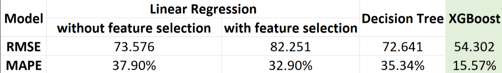

```{r setup, include=FALSE}
# some of common options (and the defaults) are: 
# include=T, eval=T, echo=T, results='hide'/'asis'/'markup',..., collapse=F, warning=T, message=T, error=T, cache=T, fig.width=6, fig.height=4, fig.dim=c(6,4) #inches, fig.align='left'/'center','right', 
# knitr::opts_chunk$set(warning = F, results = "markup", message = F)
knitr::opts_chunk$set(warning = F, results = "hide", message = F)
# knitr::opts_chunk$set(include = F)
# knitr::opts_chunk$set(echo = TRUE)
options(scientific=T, digits = 3) 
# options(scipen=9, digits = 3) 
# ‘scipen’: integer. A penalty to be applied when deciding to print numeric values in fixed or exponential notation.  Positive values bias towards fixed and negative towards scientific notation: fixed notation will be preferred unless it is more than ‘scipen’ digits wider.
# use scipen=999 to prevent scientific notation at all times
```


```{r importing libraries, include=FALSE}
library(tidyverse) 
library(tidygraph)
library(networkD3)
library(ezids)
library(chron)
library(flipPlots)
library(maps)
library(geosphere)
library(dplyr)
library(plotly)
library(Metrics)
library(xgboost)
library(ggplot2)
library(DescTools)
library(moments)
library(caret)
library(corrplot)
library(gridExtra)
library(terra)
library(rlang)
library(pkgload)
library(leaps)
library(vtable)
library(psych)
loadPkg("rpart.plot")
loadPkg("rattle")
loadPkg("ISLR")
loadPkg("tree")

options(warn=-1)


```


# Intoduction

In the 21st century, people started travelling a lot, either for business, leisure, or adventure, with the number of passengers served by flights increasing exponentially. For the past 2 years, we were restricted from traveling due to the Pandemic and now restrictions have been eased and the demand to travel has gone back up.  
The airlines deploy multiple machine learning models to update the flight ticket price numerous times over a day. They utilize hundreds of features available at their disposal, including all the flight details like departure and arrival city, time, date, user traffic on the day of booking, previous year's demand over a specific period, etc. This led to many travel hacks claiming to reduce ticket prices for passengers.

<br>


# SMART Questions

Here are the list of SMART Questions I am trying to answer:

1. How expensive are business class seats compared to its economy counterparts?  
2. Do flights with stops offer a better price than non-stop flights?  
3. Which combination of days and time gives us the best price?
4. What combination of variables gives us a best model to predict flight prices?
5. What kind of model gives us a better prediction of flight prices?


# Description of the Data

## Understanding data and Preprocessing

The data has been downloaded from kaggle.com link to which has been provided in the reference section.    

This dataset contains information about flight booking options from the website “Ease my trip” for flight travel between India’s top 6 metro cities. The data was collected for 50 days, from February 11th to March 31st, 2022.

It has 300,261 observations and 9 variables of the following:


***Date ***:        Date of departure

***Dep_time ***:       Departure time

***From ***:      Departing city

***Arr_time ***:     Arrival time

***To ***:       Arrival city

***Airline ***:    The name of the airline carrier for the journey.

***Class ***:      Business or economy seat.

***Time_Taken ***:     Flight duration

***Stop ***:      Number of stops between departure and arrival city.

***Price ***:      The cost of the ticket.

<br>

As with any data, the data I acquired needed to be cleaned and new features have been added to aid the analysis down the line.


The preprocessing :

* Bucketing the time into categories (morning, afternoon, evening, night, and midnight)  
* Adding co-ordinates to the cities (Latitude, Longitude)  
* Finding distances between the cities  
* Extracting day, weekends, months from date feature  
* Creating the flight_code from airline code and flight number  
* Converting price from rupees to dollars, distance from kilometers to miles  
* Creating dummy variables (converting categorical variables to numerical)
* Removing outlier values
* Standardizing the numerical variables


In addition to the features present in the data, feature engineernig generated these new set of features

***flight_code ***:            flight code of a particular journey from source to destination

***dep_time_cat ***:           Departure time in category (Morning, Afternoon....)

***arr_time_cat ***:           Arrival time in category (Afternoon, Evening, Night....)

***month ***:                  Month of the departure (February, March....)

***day ***:                    Day of scheduled departure (Monday, Tuesday....)

***Weekend***:                 Is the departure day a weekend or not.

***time_taken_hours ***:       Duration of flight in hours

***time_taken_minutes ***:     Duration of flight in minutes

***from_location ***:          Geographical co-ordinates of departure city (Latitude, Longitude)

***to_location ***:            Geographical co-ordinates of arrival city (Latitude, Longitude)

***distance ***:               Distance of journey in miles


```{r preprocessing, include = T}

# # functions to preprocess
# #creating buckets for different departure times
# time_category <- function(x){
#   time <- as.integer(strsplit(x,":")[[1]][1])
#   if(time <= 5) {return("mid night")}
#   else if(time >5 & time <=10) {return ("morning")}
#   else if(time >10 & time <=15) {return ("afternoon")}
#   else if(time >15 & time <=20) {return("evening")}
#   else if(time >20){return("night")}
# }
# 
# 
# # co-ordinates of the city
# location <- function(city){
#   if(city == "Delhi")  {return("28.7041, 77.1025")}
#   else if(city == "Mumbai") {return("19.0760, 72.8777")}
#   else if(city == "Bangalore") {return("12.9716, 77.5947")}
#   else if(city == "Kolkata") {return("22.5726, 88.3639")}
#   else if(city == "Hyderabad") {return("17.3850, 78.4867")}
#   else if(city == "Chennai") {return("13.0827, 80.2707")}
# }
# 
# 
# # Finding distance between two co-orinates
# find_distance <- function(x){
#   from_location <- x["from_location"]
#   to_location <- x["to_location"]
# 
#   from_lat <- as.double(strsplit(from_location,", ")[[1]][1])
#   from_long <- as.double(strsplit(from_location,", ")[[1]][2])
#   to_lat <- as.double(strsplit(to_location,", ")[[1]][1])
#   to_long <- as.double(strsplit(to_location,", ")[[1]][2])
# 
#   distance <-round((distm(c(from_long,from_lat),c(to_long,to_lat), fun = distHaversine)[1]/1000),digits = 2)
#   return(distance)
# }
# 
# 
# # Reading the data
# data <- read.csv("C:/Users/LEGION/OneDrive/Desktop/GW/sem_1/intro to Data Science/midterm/data/airline.csv")
# 
# 
# # Feature engineering new columns for the Month, Day, and weekend
# data$month <- months(as.Date(data$date))
# data$day <- weekdays(as.Date(data$date))
# data$weekend <- ifelse(data$day == "Sunday" | data$day == "Saturday", 1, 0)
# 
# # Cleaning the feature price 
# data$price <- gsub(",", "", data$price)
# data$price <- as.integer(data$price/80)
# 
# # combining airline code and flight number to make the flight code
# data$flight_code <- paste(data$ch_code, "-", data$num_code)
# 
# 
# # removing unwanted columns
# data_1 <- subset(data, select = -c(ch_code, num_code))
# data_1$time_taken_hms <- hm(data_1$time_taken)
# 
# # Engineering two new features, duration of flight in hours and in minutes
# data_1$time_taken_minutes <- hour(data_1$time_taken_hms)*60 + minute(data_1$time_taken_hms)
# data_1$time_taken_hours <- round(data_1$time_taken_minutes/60,2)
# 
# data_1 <- subset(data_1, select = -c(time_taken))
# 
# 
# 
# # Categorising the departure and arrrival times
# 
# data_1["dep_time_cat"] <- apply(X = data_1["dep_time"], FUN = time_category, MARGIN = 1)
# data_1["arr_time_cat"] <- apply(X = data_1["arr_time"], FUN = time_category, MARGIN = 1)
# 
# 
# dep_time_1 <- as_hms(strptime(data_1$dep_time,format = "%H:%M"))
# data_1$dep_time <- dep_time_1
# 
# 
# arr_time_1 <- as_hms(strptime(data_1$arr_time,format = "%H:%M"))
# data_1$arr_time <- arr_time_1
# 
# # Adding from and to co-ordinates to the cities
# 
# data_1["from_location"] <- apply(X = data_1["from"], FUN = location, MARGIN = 1)
# data_1["to_location"] <- apply(X = data_1["to"], FUN = location, MARGIN = 1)
# 
# 
# # Adding new feature "distance" between departure and arrival city
# data_1['distance'] <- apply(X = data_1,FUN = find_distance, MARGIN = 1)
# 
# # Rearranging the columns in correct order
# data_1 <- data_1[, c("airline","flight_code","date","from","dep_time","dep_time_cat","to","arr_time","arr_time_cat",
#                  "stop","class","price","month","day","weekend","time_taken_hms","time_taken_hours",
#                  "time_taken_minutes", "from_location","to_location","distance")]
# 
# 
# # Saving the dataframe into a .csv file
# # write.csv(df_1, "C:/Users/LEGION/OneDrive/Desktop/GW/sem_1/intro to Data Science/midterm/data/final_data.csv", row.names=FALSE)

```


```{r covid data, include=F}
#reading covid data for india for the months Jan to Mar

covid_df <-  read.csv("../data/india_jan_mar_covid.csv")
covid_df$date <- as.Date(covid_df$date, format =  "%d-%m-%Y")
```


```{r flight data, include=TRUE, results= TRUE}

df <-  read.csv("../data/final_data.csv")
df$date <- as.Date(df$date, format =  "%Y-%m-%d")

factor_cols <- c("airline","flight_code","from","to","dep_time_cat","arr_time_cat",
                 "stop","class","month")

for (col in factor_cols){
  df[,col] <- as.factor(df[,col])
}

time_cols <- c("dep_time","arr_time")
for (col in time_cols){
  df[,col] <- chron(times = df[,col])
}


df$day <- factor(df$day, levels= c("Monday","Tuesday", "Wednesday", "Thursday", "Friday", "Saturday","Sunday"))


df$airline <- factor(df$airline, levels= c("Indigo","Air India", "GO FIRST", "Vistara", "AirAsia", "SpiceJet","StarAir","Trujet"))


xkabledplyhead(df, title = "Flight data")

```


## Summary statistics


<br>

A high level overview of the data I am dealing with:


1. The Departure time ranges from 00:10 AM in the Morning to 23:55 PM in the Night.

2. And the Arrival time ranges from 00:05 AM in the Morning to 23:59 PM in the Night.

3. There are 3 possible values for stops i.e 0(nonstop), 1, 2+ stops.

4. There are two classes of tickets Business and Economy.

5. Is the day of departure a weekend or not (has values 0 or 1)

6. Time taken for the journey ranging from 50 minutes to 49.8 Hours

7. The distance covered by the flight with a minimum of 181 to a maximum of 1100 miles.

```{r, include=T, results=FALSE}
#removing duplicated rows

df_1 <- distinct(df, airline,flight_code,date,from,dep_time,to,arr_time,class, .keep_all= TRUE)
```

# EDA   

## Flight map

```{r plot connections function, include=FALSE}

# function to map connections to cities on the map.

plot_my_connection=function( dep_lon, dep_lat, arr_lon, arr_lat, ...){
    inter <- gcIntermediate(c(dep_lon, dep_lat), c(arr_lon, arr_lat), n=50, addStartEnd=TRUE, breakAtDateLine=F)             
    inter=data.frame(inter)
    diff_of_lon=abs(dep_lon) + abs(arr_lon)
    if(diff_of_lon > 180){
        lines(subset(inter, lon>=0), ...)
        lines(subset(inter, lon<0), ...)
    }else{
        lines(inter, ...)
        }
    }
```


```{r,include=TRUE,results='markup'}

#mapping the major cities of india 

Delhi <- c(77.1025,28.7041)
Mumbai <- c(72.8777,19.0760)
Bangalore <- c(77.5947,12.9716)
Kolkata <- c(88.3639,22.5726)
Hyderabad <- c(78.4867,17.3850)
Chennai <- c(80.2707,13.0827)
  

# Data frame
data <- rbind(Delhi, Mumbai,Bangalore, Kolkata, Hyderabad, Chennai) %>% 
  as.data.frame()
colnames(data) <- c("long","lat")

# World map
map('world',
    col="#d5d6d8", fill=TRUE, bg="white", lwd=0.05,
    mar=rep(0,4),border=0,xlim = c(68,98),ylim=c(8,37) )

points(x=data$long, y=data$lat, col="black", cex=1.5, pch=20)


# Generate all pairs of coordinates
all_pairs <- cbind(t(combn(data$long, 2)), t(combn(data$lat, 2))) %>% as.data.frame()
colnames(all_pairs) <- c("long1","long2","lat1","lat2")


# add every connections:
for(i in 1:nrow(all_pairs)){
    plot_my_connection(all_pairs$long1[i], all_pairs$lat1[i], all_pairs$long2[i], 
                       all_pairs$lat2[i], col="black", lwd=1)
    }
 
# add points and names of cities
text(rownames(data), x=data$long, y=data$lat,  col="black", cex=0.5, pos=4)

```


<br>

I am trying to know the factors affecting the flight prices in these major cities of India.

***Delhi ***:   The Capital of India

***Mumbai***:   The Financial capital of India

***Kolkata***:   Biggest economy after Mumbai and Delhi

***Bangalore***:   Known as silicon valley of India

***Hyderabad***:   The city of Nizam's and booming Tech Industry

***Chennai***:   Known as the Detroit of Asia, for having several automobile manufacturing companies


<br>

## Number of flights scheduled

```{r airline frequency,include=FALSE, results='markup'}

#considering only one class for one journey(either economy or business)
# i.e if there are two rows (one for economy and one for business)
# I will drop one of those just to focus on flight journey as whole


df_for_count <- distinct(df,flight_code, date, dep_time,.keep_all = T)

air_line_cout <- data.frame(table(df_for_count$airline))

air_line_cout <- air_line_cout[order(-air_line_cout$Freq),]

air_line_cout$Freq <- as.integer(air_line_cout$Freq/49)

# xkabledplyhead(air_line_cout)
```


```{r airline frequency_1, include=T, results='markup'}


xform <- list(categoryorder = "array",
              categoryarray = c("Indigo","Air India", "GO FIRST", "Vistara", 
                                   "AirAsia", "SpiceJet","StarAir","Trujet"))

fig <- plot_ly(x = air_line_cout$Var1, y = air_line_cout$Freq, type = 'bar', color = air_line_cout$Var1,
               colors = c("Indigo" = "#1f77b4","Air India" = "#ff7f0f", "GO FIRST" = "#2ca02c", "Vistara" = "#9467bd", 
                                   "AirAsia" = "#d62728", "SpiceJet" = "#8c564b","StarAir" = "#e377c2","Trujet" = "#7f7f7f"))

fig <- fig %>% layout(xaxis = list(title = "Airline",xform), title = "Number of flights scheduled by airlines",
                      yaxis = list(title = "flights scheduled every day"), showlegend = F)

# api_create(fig, filename = "Flight traffic share of each airlines")


fig

```


***Indigo***, one of the largest airlines in India has most flight traffic of ***414*** Scheduled flights everyday between these 6 cities , followed by ***Air India*** with ***141*** flights scheduled (recently acquired by ***TATA***, a multi national conglomerate), and budget airlines like ***Go First***, ***AirAsia*** and ***SpiceJet***.

With Least number of flights operated by ***StarAir*** and ***TruJet*** as they are the latest entries to the airline industry, with just couple of flights in their fleet.

<br>

## Cities with highest traffic

```{r,include = T, results='markup'}

# number of flights between cities per day
city_freq <- rename(count(df_for_count, from, to), Freq = n)
city_freq <- city_freq[order(-city_freq$Freq),]
city_freq$Freq <- as.integer(city_freq$Freq/49)
row.names(city_freq) <- NULL
xkabledplyhead(city_freq, title = "Daily flight frequencies")
```


The Highest traffic is seen between the cities ***Delhi -> Mumbai ***,   ***Mumbai -> Delhi ***  and followed by ***Bangalore -> Delhi***.

<br>

This ***Sankey chart*** shows the ***flow of flights*** (flight traffic) in ***between*** the ***cities***.

```{r sankey chart, include = T, results='markup'}

SankeyDiagram(city_freq[, -3],link.color = "Source", 
              weights = city_freq $Freq,label.show.percentages = TRUE,
              variables.share.values = TRUE)

```


<br>

## Factors affecting the price

### 1. Class

```{r price distribution, include=T, results='markup'}
density <- density(df$price)

economy <- df[df$class == "economy",]
density_economy <- density(economy$price)
business <- df[df$class == "business",]
density_business <- density(business$price)


fig <- plot_ly(x = ~density_economy$x, y = ~density_economy$y, type = 'scatter', mode = 'lines', 
               name = 'Economy', fill = 'tozeroy')

fig <- fig %>% add_trace(x = ~density_business$x, y = ~density_business$y, name = 'Business', fill = 'tozeroy')

fig <- fig %>% layout(title = "Price distribution of economy and business class",xaxis = list(title = 'Price',range=c(0,1100)),yaxis = list(title = 'Density'))

fig

```


It is a fact that the passenger experience in business class is far superior than the experience in economy class, it is because of the service, food and the in flight entertainment. This all costs money and it is clearly visible from the plot above that ticket prices of business class lie towards the middle and right-side of the price scale ranging from as low as ***$200*** to as much as ***$1000+***, where as the whole of economy class lies almost to the left of ***$200***. 


```{r Price range for economy and business class seats, include=T, results='markup'}

xform <- list(categoryorder = "array",
              categoryarray = c("Indigo", "Air India","Vistara", "AirAsia","SpiceJet","TruJet"))


fig1 <- plot_ly(x = economy$airline, y = economy$price,type = "box", name = "economy")
fig1 <- fig1 %>% layout(title = "price range of airlines for economy and business class",
                        xaxis = list(title = "Airline", showline = T, linewidth = 0.5),
                      yaxis = list(title = "Price", showline = T, linewidth = 1,range=c(0,250)))

fig2 <- plot_ly(x = business$airline, y = business$price,type = "box", name = "business")
fig2 <- fig2 %>% layout(title = "price range of airlines for economy and business class",
                         xaxis = list(title = "Airline", showline = T, linewidth = 0.5),
                      yaxis = list(title = "price", showline = T, linewidth = 1,range=c(100,1100)))

fig2 <- fig2 %>% layout(xaxis = xform, yaxis = list(side = "right"))


fig <- subplot(fig1, fig2,shareX = T) %>% layout(title = 'Price range of business and economy tickets')

fig
```

In the ***Domestic*** market of india only ***Air India*** (India's first private airline) and ***Vistara*** (Joint collaboration of singapore airlines and TATA) operate with ***Business*** class offerings.

The remaining carriers operate only within the economy segment with average prices ranging from around ***$30*** to ***$100*** which might feel insignificant to us, but it still is a big price to pay for people in India considering their average incomes.

It is also clear from the plot that prices of business and economy classes are significantly different from each other.

<br>


conducted an ANOVA test to see if class of the seat affect the price of ticket. 


***Null Hypothesis H0:*** There is no difference in mean prices of Business and Economy class seats


***Alternate Hypothesis H1:*** The mean prices of Business and Economy seats are significantly different


i.e. Class of the seat has impact on the price.

```{r anova for domestic or economy seats, include=T, results='markup'}
anova_class = aov(price ~ class, data=df)
# print(summary(anova_class))
xkabledply(anova_class, title = "ANOVA result summary for class")
```


With the ***P-value = e-16***, I reject the Null Hypothesis and accept the Alternate Hypothesis that, the prices of Business and Economy classes are significantly different. Thus, class of seats impact the price of the ticket.


On an average, the price of Business class seats are ***`r round(mean(business$price)/mean(economy$price),2)` times more expensive*** than the economy seats.


<br>

### 2. COVID

#### 2X increase in flights
```{r date count, include=FALSE}
date_count <- data.frame(df_for_count %>% group_by(date) %>% summarise(flight_frequency = n()))
# head(date_count)

```


```{r flight frequency, include=T, results='markup'}

fig <- plot_ly(date_count, type = 'scatter', mode = 'lines')%>%
  add_trace(x = ~date, y = ~flight_frequency,name = "flight departures",line = list(color = "1f77b4"),showlegend = FALSE)

fig <- fig %>% layout(title = "Flight frequency from Feb-11 to Mar-31")
options(warn = -1)


fig

```


It is easy to observe that during mid-February to late-March, ***flight frequency increased by double***, from ***513*** to over ***1000***. So, it is obvious to see that flight frequency increased dramatically during this time.


```{r affect of covid on flight frequency, include=T,results='markup'}

vline <- function(x = 0, color = "black") {
  list(
    type = "line",
    y0 = 0,
    y1 = 1,
    yref = "paper",
    x0 = x,
    x1 = x,
    line = list(color = color)
  )
}


fig <- plot_ly()
# Add traces
fig <- fig %>% add_trace(x = ~covid_df$date, y = ~covid_df$new_cases, name = "covid cases", yaxis = "y2", mode = "lines", type = "scatter",fill = "tozeroy",fillcolor = "rgba(214,39,40,0.2)", line = list(color="d62728"))

ay <- list(
  tickfont = list(color = "black"),
  overlaying = "y",
  side = "left",
  title = "# covid +ve cases")

fig <- fig %>% add_trace(x = ~date_count$date, y = ~date_count$flight_frequency, name = "flights", mode = "lines", type = "scatter",line = list(color="1f77b4"))

# Set figure title, x and y-axes titles
fig <- fig %>% layout(
  title = "Effect of COVID and travel restrictions on flight frequency", yaxis2 = ay,
  xaxis = list(title="Date"),
  yaxis = list(side = "right",title="Flight frequency")
)%>%
  layout(plot_bgcolor='white',
          xaxis = list(
            zerolinecolor = '#ffff',
            zerolinewidth = 2,
            gridcolor = 'ffff'),
          yaxis = list(
            zerolinecolor = '#ffff',
            zerolinewidth = 2,
            gridcolor = 'ffff')
          )


fig <- fig %>% add_annotations(text = "COVID Restrictions relaxed", x = as.Date("2022-02-14"), y = 650,showarrow = T, ax = 85,ay = -70)

fig <- fig %>% add_annotations(text = "COVID 3rd wave in India", x = as.Date("2022-01-21"), y = 600, showarrow = F)

fig <- fig %>% layout(shapes = list(vline(as.Date("2022-02-14"))))

fig

```

The reasons are due to the COVID cases decreasing and relaxation of travel restrictions in India.  
I downloaded the COVID dataset from [Our World in data](https://ourworldindata.org/coronavirus/country/india). I found an interesting relation between the number of COVID cases per day and flight frequency. We can observe from the plot, that COVID cases reached maximum of ***347.2K***, on ***January 20*** and decreased to ***50.4K*** by ***February 11***. Besides, ***COVID travel restrictions*** were ***relaxed*** on ***February 14***. 


<br>

#### The drop in price

```{r include=F, results=F}
economy_avg_price <- data.frame(economy %>% group_by(date) %>% summarise(average_price = mean(price)))

date <- economy_avg_price$date
avg_price <- economy_avg_price$average_price

Data <- list(date = date,
             avg_price = avg_price)

price_df <-  as.data.frame(Data)

# xkabledplyhead(price_df)

```


```{r effect of covid on price,include=T, results='markup'}
vline <- function(x = 0, color = "black") {
  list(
    type = "line",
    y0 = 0,
    y1 = 1,
    yref = "paper",
    x0 = x,
    x1 = x,
    line = list(color = color)
  )
}


fig <- plot_ly(price_df, x = ~date) 
fig <- fig %>% add_trace(y = ~avg_price, type = "scatter",name = '0 stops',mode = 'lines',
                         hovertemplate = paste('<b>Date</b>: %{x}<br>','<b>Average Price</b>: %{y:.2f}')) 

fig <- fig %>% add_annotations(text = "Covid Restrictions relaxed", x = as.Date("2022-02-14"), y = 100,showarrow = T, ax = 85,ay = 45)

fig <- fig %>% layout(shapes = list(vline(as.Date("2022-02-14"))), title = "Average Price vs Date",
                      xaxis = list(title = "Date"),yaxis = list(title = "Average Price")) 

fig
```


As for the consequence of increasing flight frequency,  the prices of flight tickets dropped by about one third, from ***$182.66*** to ***$58.37***, within period mentioned. 

<br>

I conducted a Two Sample T-Test to see if this price drop is significant enough.    

***Null Hypothesis H0 ***:   There is no difference in price before and after travel restrictions were relaxed

***Alternate Hypothesis H1 ***:   There is a significant difference in the price before and after the travel restrictions were relaxed


```{r did covid had effect on flight prices, include=T, results='markup'}

with_restrictions <- df[df$date <= as.Date("2022-02-14"),]
restrictions_relaxed <- df[df$date > as.Date("2022-02-14"),]

ttest_covid_price = t.test(with_restrictions$price,restrictions_relaxed$price)
print(ttest_covid_price)
```


With the ***P-value = 2e-16***, I successfully reject the Null Hypothesis that, there is a significant difference in the price before and after the travel restrictions were relaxed. Therefore, relaxation of travel restrictions have a significant impact on the price. 


<br>


### 3. Stops

As The flight frequency between Delhi(National capital) and Mumbai(Financial capital) is high, I will consider these flights for further analysis

***Effect of total stops on price***

```{r,include=F}
# subsetting flights which travel between Mumbai and Delhi with economy seats and are non stop

dm <- df[((df$from == "Mumbai" & df$to == "Delhi") | (df$from == "Delhi" & df$to == "Mumbai"))&(df$class == "economy"),]
dm  <- distinct(dm, flight_code, date, dep_time,.keep_all = T) 

dm_ns <- df[((df$from == "Mumbai" & df$to == "Delhi") | (df$from == "Delhi" & df$to == "Mumbai"))&(df$class == "economy")&(df$stop=="0"),]
dm_ns  <- distinct(dm_ns,flight_code, date, dep_time,.keep_all = T)


dm_s <- df[((df$from == "Mumbai" & df$to == "Delhi") | (df$from == "Delhi" & df$to == "Mumbai"))&(df$class == "economy")&(df$stop!="0"),]
dm_s  <- distinct(dm_s,flight_code, date, dep_time,.keep_all = T)
```


```{r price range based on stops, include=T, results='markup'}
fig <- plot_ly(x = dm$stop, y = dm$price,type = "box",color = dm$stop)
fig <- fig %>% layout(title = "price range of flights based on number of stops",
                        xaxis = list(title = "Stops", showline = T, linewidth = 0.5),
                      yaxis = list(title = "Price", showline = T, linewidth = 1,range=c(0,180)),
                      showlegend = F)

fig

```

I observe that flights with 1 or more stops have higher prices than non stop flights.

Every time a plane lands to an airport, there is more things to consider than just to safely land: it pays a fee to airports, refuel the plane, restock snacks and drinks on the plane, etc., which all cost money. This has greater impact on domestic than the international flights (which operate on different business model). 

<br>

conducted a ANOVA test to see if number of stops affect the price.  

***Null Hypothesis H0 ***:   The mean of flight prices with different number of stops are same

***Alternate Hypothesis H1 ***:   The mean of flight prices with different number of stops are significantly different.

i.e. Number of stops affect the price of the flight ticket.


```{r anova for flights with non stop or more than one stop, include=T, results='markup'}
anova_class = aov(price ~ stop, data=dm)
#summary(anova_class)
xkabledply(anova_class, title = "ANOVA test summary for stop")

```

With the ***P-value = 2e-16***, reject the Null Hypothesis that, there is significant difference in flight price mean with different number of stops. Thus, I am confident that the number of stops affect the price of the flight ticket.

<br>

### 4. Day and time of departure


```{r, include=F, results=F}
find_hr <- function(x){
  time <- as.character(x["dep_time"])
  hour <- as.integer(strsplit(time,":")[[1]][1])
  return(hour)
}

df_for_count$hour <- apply(X = df_for_count, FUN = find_hr, MARGIN = 1)

```


```{r frequency by time, include=F}

time_count <- data.frame(df_for_count %>% group_by(hour) %>% summarise(flight_frequency = as.integer(n()/49)))

```

#### Flight frequency over the day

```{r, include=T, results='markup'}

fig <- plot_ly(time_count, type = 'scatter', mode = 'lines')%>%
  add_trace(x = ~hour, y = ~flight_frequency,name = "",line = list(color = "1f77b4"),showlegend = FALSE,
                hovertemplate = paste('<b>Hour</b>: %{x}<br>','<b>flight frequency</b>: %{y:.2f}'))

fig <- fig %>% layout(title = "Average flight frequency over 24 hours of the day",
                      xaxis = list(title = "Hour"), yaxis = list(title = "Flight frequency"))
options(warn = -1)

fig <- fig %>% layout(shapes = list( list(type = "rect",line = list(color = "rgba(42,34,94,0.2)"),
                                        x0 = 0, x1 = 4.99,y0 = 1,y1 = 80,fillcolor = "rgba(42,34,94,0.2)"),
                                     list(type = "rect",line = list(color = "rgba(242,145,2,0.2)"),
                                        x0 = 5, x1 = 9.99,y0 = 1,y1 = 80,fillcolor = "rgba(242,145,2,0.2)"),
                                     list(type = "rect",line = list(color = "rgba(253,234,16,0.2)"),
                                        x0 = 10, x1 = 14.99,y0 = 1,y1 = 80,fillcolor = "rgba(253,234,16,0.2)"),
                                     list(type = "rect",line = list(color = "rgba(147,192,27,0.2)"),
                                        x0 = 15, x1 = 19.99,y0 = 1,y1 = 80,fillcolor = "rgba(147,192,27,0.2)"),
                                     list(type = "rect",line = list(color = "rgba(48,128,201,0.2)"),
                                        x0 = 20, x1 = 24,y0 = 1,y1 = 80,fillcolor = "rgba(48,128,201,0.2)")), plot_bgcolor = "white")

fig <- fig %>% add_annotations(text = "Mid Night", x = 2.5,y = 65,showarrow = F) %>%
                add_annotations(text = "Morning", x = 7.5, y = 35,showarrow = F) %>%
                add_annotations(text = "Afternoon", x = 12.5,y = 35,showarrow = F) %>%
                add_annotations(text = "Evening", x = 17.5, y = 35,showarrow = F) %>%
                add_annotations(text = "Night", x = 22,y = 65,showarrow = F)


fig


```


Flight frequency is high in the morning and evening when compared to other time categories.

This is predictable, as people often prefer to travel to a destination, finish the work in hand, and return back home by the end of the day.


```{r}

dm_over_week <- data.frame(dm %>% group_by(day) %>% summarise(average_price = mean(price)))

```

#### The weekend demand
```{r price over the week,include=T, results='markup'}

fig <- plot_ly(dm_over_week, type = 'scatter', mode = 'lines')%>%
  add_trace(x = ~day, y = ~average_price,name = "",line = list(color = "1f77b4"),showlegend = FALSE,
            hovertemplate = paste('<b>Day</b>: %{x}<br>','<b>Average Price</b>: %{y:.2f}')) %>%
                layout(title = 'Average ticket price of economy seats over the week', plot_bgcolor = "white", xaxis = list(title = 'Day'), 
                          yaxis = list(title = 'Price'))


fig

```

As the demand for travel increases on weekends, there is a clear trend of price rise as we get closer to weekend, with ***maximum prices*** seen on ***Saturday*** and ***Sunday***.

The ***lowest price*** is seen on ***Tuesday's***.


<br>

#### Best time to fly

From the previous plot I concluded that ***Tuesday*** offers the lowest price, now it is time to analyse what time on Tuesday offers the lowest price.

```{r price distribution on tuesday, include=T, results='markup'}

dm_friday <- dm[dm$day == "Friday",]
dm_friday$hour <- apply(X = dm_friday, FUN = find_hr, MARGIN = 1)

dm_over_day <- data.frame(dm_friday %>% group_by(hour) %>% summarise(average_price = mean(price)))

# head(dm_over_day)

fig <- plot_ly(dm_over_day, type = 'scatter', mode = 'lines')%>%
  add_trace(x = ~hour, y = ~average_price,name = "",line = list(color = "1f77b4"),showlegend = FALSE,
            hovertemplate = paste('<b>Hour</b>: %{x}<br>','<b>Average Price</b>: %{y:.2f}')) %>%
                layout(title = 'Average price of economy seats over tuesday', plot_bgcolor = "white", xaxis = list(title = 'Hour'), 
                          yaxis = list(range = c(25,110),title = 'Price'))


fig <- fig %>% layout(shapes = list( list(type = "rect",line = list(color = "rgba(42,34,94,0.2)"),
                                        x0 = 0, x1 = 4.99,y0 = 1,y0 = 25,y1 = 115,fillcolor = "rgba(42,34,94,0.2)"),
                                     list(type = "rect",line = list(color = "rgba(242,145,2,0.2)"),
                                        x0 = 5, x1 = 9.99,y0 = 1,y0 = 25,y1 = 115,fillcolor = "rgba(242,145,2,0.2)"),
                                     list(type = "rect",line = list(color = "rgba(253,234,16,0.2)"),
                                        x0 = 10, x1 = 14.99,y0 = 1,y0 = 25,y1 = 115,fillcolor = "rgba(253,234,16,0.2)"),
                                     list(type = "rect",line = list(color = "rgba(147,192,27,0.2)"),
                                        x0 = 15, x1 = 19.99,y0 = 1,y0 = 25,y1 = 115,fillcolor = "rgba(147,192,27,0.2)"),
                                     list(type = "rect",line = list(color = "rgba(48,128,201,0.2)"),
                                        x0 = 20, x1 = 24,y0 = 1,y0 = 25,y1 = 115,fillcolor = "rgba(48,128,201,0.2)")), plot_bgcolor = "white")

fig <- fig %>% add_annotations(text = "Mid Night", x = 2.5,y = 95,showarrow = F) %>%
                add_annotations(text = "Morning", x = 7.5, y = 55,showarrow = F) %>%
                add_annotations(text = "Afternoon", x = 12.5,y = 55,showarrow = F) %>%
                add_annotations(text = "Evening", x = 17.5, y = 55,showarrow = F) %>%
                add_annotations(text = "Night", x = 22,y = 95,showarrow = F)


fig

```


The price of flights is low during the odd hours of ***Night*** and ***Mid Night***.

Considering the prices on different days and by hour, it is recommended to fly on Tuesday's and in odd hours in between ***10:00 Pm*** and ***4:00 AM***.   

<br>

# Model Building

```{r reading, include=TRUE, results='markup'}

df = read.csv("../data/Final_data_with_Covid_cases.csv")


df$hour <- apply(X = df, FUN = find_hr, MARGIN = 1)

df <- df %>% mutate(stop = recode(stop, "0" = 'non_stop', "1" = '1_stop', "2+" =  '2_or_more' ))


df$weekend <- with(df, factor(weekend, levels = c(1, 0), labels = c("Yes", "No")))


xkabledplyhead(df)


```

Before we started building models, I dropped few unwanted columns:  
  
1. ***flight code*** (as it has a lot of classes)  

2. ***date*** (instead I am using month and date)

3. Departure and arrival time (instead I am using departure and arrival time in category)

4. ***time_taken_in_minutes***

5. ***from_location *** and ***to_location***


```{r dropping un wanted columns, include=TRUE, results='markup'}
cols_drop = c("flight_code", "date", "dep_time", "arr_time", "time_taken_hms", "time_taken_minutes", "from_location", "to_location")

df_2 <- df[, !colnames(df) %in% cols_drop]

xkabledplyhead(df_2, title = "Dataframe after removing unwanted columns")
```

<br>

## Removing outliers

After dropping unwanted columns, removed outliers after grouping the data based on class of the ticket.

<br>

***Reasoning***:

There is a huge difference between the prices of tickets of Business class and Economy class passengers, this is why I separated the data into two different groups and handled the outliers in them, which gives us more control on how the outliers are removed.


```{r removing outliers, include=TRUE, results='markup'}


# grouping the data based on class and replacing the outlier values by NA and subsiquently removing them.

df_cleaned <- df_2 %>% group_by(class) %>% 
            mutate(price_cleaned= ifelse(price>quantile(price, 0.75, na.rm = T)+1.5*IQR(price, na.rm = T) |
                                           price<quantile(price, 0.25, na.rm = T)-1.5*IQR(price, na.rm = T), NA, price))


# colSums(is.na(df_cleaned)) 
# print(dim(df_cleaned))


df_cleaned <- df_cleaned %>% drop_na()
df_cleaned <-  df_cleaned[, colnames(df_cleaned)[colnames(df_cleaned) != 'price_cleaned']]
# print(dim(df_cleaned))


xkabledplyhead(df_cleaned, title = "Cleaned dataframe")
```

 ***`r (dim(df_2)[1] - dim(df_cleaned)[1])`*** outlier observations are removed from the data.

<br>

## Preprocessing


```{r str, include=FALSE}
str(df_cleaned)
```


I did some additional prepocessing of the data, by separating numerical and categorical columns to deal with them appropriately.

***For Numerical features***

1. Reduced the skewness of price with log transformation
2. Scaled and Standardized numerical variables with mean of 0 and standard deviation of 1


```{r model preprocessing, include=TRUE, results='markup'}


numericVarNames <-  c('time_taken_hours', 'distance', 'Daily_covid_cases', "hour")
DFnumeric <- df_cleaned[, names(df_cleaned) %in% numericVarNames]
DFfactors <- df_cleaned[, !(names(df_cleaned) %in% numericVarNames)]
DFfactors <- DFfactors[, names(DFfactors) != 'price']

cat('There are', length(DFnumeric), 'numeric variables, and', length(DFfactors), 'factor variables')


```


Skewness is a measure of the symmetry in a distribution. A symmetrical dataset will have a skewness equal to 0. So, a normal distribution will have a skewness of 0. Skewness essentially measures the relative size of the two tails. As a rule of thumb, skewness should be between -1 and 1. In this range, data are considered fairly symmetrical. In order to fix the skewness, I am taking the log for all numeric predictors with an absolute skew greater than 0.8 (actually: log+1, to avoid division by zero issues).

<br>


***For Categorical features***

1. Converted them to Numerical by One-Hot-Encoding (creating Dummies)


```{r dealing with skewed data and standardizing them, include=TRUE, results='markup'}

#adding log(feature + 1) to remove skewness

for(i in 1:ncol(DFnumeric)){
        if (abs(skewness(DFnumeric[,i]))>0.8){
                DFnumeric[,i] <- log(DFnumeric[,i] +1)
        }
}

# standardizing the data
PreNum <- preProcess(DFnumeric, method=c("center", "scale"))
DFnorm <- predict(PreNum, DFnumeric)


```


This is done as XGBoost model cannot interpret the categorical columns, and features are supposed to be in a numerical data type.

```{r dummies, include=TRUE, results='markup'}
DFdummies <- as.data.frame(model.matrix(~.-1, DFfactors))
xkabledplyhead(DFdummies, title = "Data frame after creating dummies")
```

<br>

After the additional preprocessing was done, One-Hot-Encoding resulted in 39 columns from 10 factor features. ***Combining*** both the numerical and categorical features back together to create a final dataframe.

```{r combining, include=TRUE, results='markup'}


combined <- cbind(DFnorm, DFdummies, price = df_cleaned$price)
xkabledplyhead(combined, title = "Final dataframe after preprocessing numerical and categorical features")

```


<br>

***Splitting data into train and test***

This helps us understand how well the model has learned on train data, by looking at the performance metrics on the test dataset. I split the dataset to 70% train data, and 30% test data. Also handled skewness on the price column after splitting the data into train and test data.

```{r train test split, include=TRUE, results='markup'}
#make this example reproducible
set.seed(1)

#Use 70% of dataset as training set and remaining 30% as testing set
sample <- sample(c(TRUE, FALSE), nrow(combined), replace=TRUE, prob=c(0.7,0.3))
train  <- combined[sample, ]
test   <- combined[!sample, ]

x_train <- train[, colnames(train)[colnames(train) != 'price']]
y_train <- train$price
  
x_test <- test[, colnames(test)[colnames(test) != 'price']]
y_test <- test$price


# copying the actual y labels before transforming them (log transform), for future model evaluation
y_train_actuals <- duplicate(y_train)
y_test_actuals <- duplicate(y_test)


# removing skewness by log tranformation
cat("Skewness of train price before transformation", skewness(y_train_actuals))
y_train <- log(y_train) #default is the natural logarithm, "+1" is not necessary as there are no 0's
cat("\nSkewness of train price after transformation", skewness(y_train))


cat("\n\nSkewness of test price before transformation", skewness(y_test_actuals))
y_test <- log(y_test) 
cat("\nSkewness of test price after transformation", skewness(y_test))


```
<br>

After splitting the dataset, I have ***`r dim(x_train)[1]`*** observations in train and ***`r dim(x_test)[1]`*** observations in test. I also have ***reduced the Skewness of price*** in both train and test data sets ***by almost 50%.***


<br>


## Linear regression on single variables

First,  built linear regression models with single variable based on their impact on price found during the EDA.  

1. Class

2. Covid

3. Stops

4. Day and time of departure


***Performance metrics used:***

1. RMSE (Root Mean Squared Error)

As the dependent variable (Price) is of numerical data type, RMSE helps us understand and compare the performance of different models use,

2. MAPE (Mean Absolute Percentage Error)

For any one not fully into Data, it is difficult for them to understand what RMSE actually represents, where as MAPE is easily understandable, as if I predict something, how much percentage of error of the predicted value can they expect. This makes it easy for people of non data science back ground to understand the model performance better. 

<br>

### Class
```{r class, include=TRUE, results='markup'}

model_class = lm(price ~ classeconomy, data = train)
print(summary(model_class))


y_test_class_predictions <- predict(model_class, x_test)


```

<br>

***Observations***

The Performance of the ***Linear regression*** model ***based on*** the predictor ***Class*** has achieved an Adjusted R^2 of ***0.914***, which is a decent score considering only one variable is used.


***Test RMSE***,(Root Mean Squared Error) : ***`r rmse(y_test_actuals,y_test_class_predictions)`***

***Test MAPE***,(Mean Absolute Percentage Error) : ***`r mean(abs((y_test_actuals-y_test_class_predictions)/y_test_actuals)) * 100`%*** (model predicts with average error percentage of `r mean(abs((y_test_actuals-y_test_class_predictions)/y_test_actuals)) * 100`%)

Given only one variable is being used to predict the price of the ticket, MAPE of 36.6% can still be considered pretty good.

<br>

### Covid
```{r covid, include=TRUE, results='markup'}

model_covid = lm(price ~ Daily_covid_cases, data = train)
print(summary(model_covid))


y_test_covid_predictions <- predict(model_covid, x_test)


```

<br>

***Observations***

The univariate variate model with ***daily covid cases does not provide with satisfactory results***. The model built with daily covid cases (which showed a strong effect on price during EDA) does not have enough predictive power with Ajdusted R^2 value of ***0.012***. 

***Test RMSE***,(Root Mean Squared Error) : ***`r rmse(y_test_actuals,y_test_covid_predictions)`***

***Test MAPE***,(Mean Absolute Percentage Error) : ***`r mean(abs((y_test_actuals-y_test_covid_predictions)/y_test_actuals)) * 100`%*** (model predicts with average error percentage of `r mean(abs((y_test_actuals-y_test_covid_predictions)/y_test_actuals)) * 100`%)

The performance of the model is really poor with an error percentage of 241%, which is not at all acceptable.

<br>

### Stops

```{r stops, include=TRUE, results='markup'}

model_stop = lm(price ~ stop2_or_more	+ stopnon_stop, data = train)
print(summary(model_stop))


y_test_stop_predictions <- predict(model_covid, x_test)


```

<br>

***Observations***

Though the variable shows importance, but the Adjusted R^2 is quite low ***0.0453.***

***Test RMSE***,(Root Mean Squared Error) : ***`r rmse(y_test_actuals,y_test_stop_predictions)`***

***Test MAPE***,(Mean Absolute Percentage Error) : ***`r mean(abs((y_test_actuals-y_test_stop_predictions)/y_test_actuals)) * 100`%*** (model predicts with average error percentage of `r mean(abs((y_test_actuals-y_test_stop_predictions)/y_test_actuals)) * 100`%)

Again, the performance of the model is really poor with an error percentage of 241%.


<br>


### day and time

```{r day and time, include=TRUE, results='markup'}

model_dt = lm(price ~ hour	+ dayMonday + dayTuesday + dayWednesday + dayThursday + daySaturday + daySunday, data = train)
print(summary(model_dt))


y_test_dt_predictions <- predict(model_covid, x_test)


```

<br>

***Observations***

Again, here the Adjusted R^2 is quite low with ***0.00123.***

***Test RMSE***,(Root Mean Squared Error) : ***`r rmse(y_test_actuals,y_test_dt_predictions)`***

***Test MAPE***,(Mean Absolute Percentage Error) : ***`r mean(abs((y_test_actuals-y_test_dt_predictions)/y_test_actuals)) * 100
`%*** (model predicts with average error percentage of `r mean(abs((y_test_actuals-y_test_dt_predictions)/y_test_actuals)) * 100
`%)

<br>

### Conclusion : univariate linear models

From the models built above, I can conclude that the performance of the models are poor, except for the feature
***Class*** with Adjusted R^2 of 0.914 and RMSE of 83.7 and MAPE of 36.6. The price is related to the features in a more complex way and it needs more than just one variable to predict with good performance metric.


<br>

## Building multivariate models

### Base Linear Regression Model

I built a ***base Linear regression model*** with all the features in our dataset.

```{r linear regression, include=TRUE, results='markup'}
#make this example reproducible
set.seed(1)


model = lm(price ~ ., data = train)
print(summary(model))

```

<br>

As a result, features in our dataset has given a good results with ***Adjusted R^2*** of ***0.933.***


```{r ln performance, include=TRUE, results='markup'}

y_pred = predict(model, test)

```

***Test RMSE***,(Root Mean Squared Error) : ***`r rmse(test$price,y_pred)`***

***Test MAPE***,(Mean Absolute Percentage Error) : ***`r mean(abs((test$price-y_pred)/test$price)) * 100`%*** (model predicts with average error of `r mean(abs((test$price-y_pred)/test$price)) * 100`%)

With the MAPE value of 38%, this baseline linear model is considered pretty good. 

<br>


#### Feature selection for Linear regression

I performed Feature selection among the variables and have in our dataset to come up with a better linear regression than the baseline model.  

performed all three different methods, Adjusted R^2, BIC and Cp. 

```{r feature selection 1, include=TRUE, results='markup'}
reg <- regsubsets(price~., data = train, nvmax = 5, nbest = 2, method = "exhaustive") 
plot(reg, scale = "adjr2", main = "Adjusted R^2")
plot(reg, scale = "bic", main = "BIC")
plot(reg, scale = "Cp", main = "Cp")
summary(reg)
```


Based on the result above, three plots showed same pattern therefore I decided to only consider Adjusted R^2 plot. From here, picked two models with the same Adj R^2 value, but with the most number of features and the least number of features and tested which one to choose.  

<br>

***Testing two models with same Adj R^2 value, but different number of features and deciding which is better***


Based on Regsubsets feature selection (with Adjusted R^2 > 0.93) the most important features for model_1(the most number of features) are:

1. Daily_covid_cases

2. fromChennai

3. fromMumbai

4. classeconomy

5. monthMarch

6. toMumbai


```{r lm feature selection 1 model, include=TRUE, results='markup'}
lm_fs_1 <- lm(price ~ Daily_covid_cases+fromChennai+fromMumbai+classeconomy+monthMarch + toMumbai, data = train)
summary(lm_fs_1)
```


Important features with similar Adj R^2 for model_2(the least number of features) are:

1. fromchennai

2. classecomomy

3. monthMarch

```{r feature selection2, include=TRUE, results='markup'}

lm_fs_2 <- lm(price ~ fromChennai+classeconomy+monthMarch, data = train)
summary(lm_fs_2)

```

<br>

***Testing two models using ANOVA***

```{r Anova on models, include=TRUE, results='markup'}

ano <- anova(lm_fs_1,lm_fs_2)
ano
```


Since both the models have similar Adjusted R^2 values (0.917 vs 0.916) and the model_2 is built using fewer variables, I will choose the model_2.


```{r lmfs1 test, include=TRUE, results='markup'}
y_pred = predict(lm_fs_2, test)
rmse(test$price,y_pred)
mean(abs((test$price-y_pred)/test$price)) * 100
```
<br>

***Test RMSE***,(Root Mean Squared Error) : ***`r rmse(test$price,y_pred)`***

***Test MAPE***,(Mean Absolute Percentage Error) : ***`r mean(abs((test$price-y_pred)/test$price)) * 100`%*** (model predicts with average error percentage of `r mean(abs((test$price-y_pred)/test$price)) * 100`%)

With MAPE of 33%, which improved from 38%, I can conclude that this linear model after the feature selection gives us better model than the baseline model. 

<br>

## Decision Tree

For the next model, I performed a Decision tree.  

```{r decision tree, include=TRUE, results='markup'}

treefitRpart <- rpart(price ~ ., data=train, control = list(maxdepth = 4, cp=0.005)) 
summary(treefitRpart)
fancyRpartPlot(treefitRpart, caption = "Decision Tree")

```

```{r DT predictions ,include=TRUE, results='markup'}
y_pred = predict(treefitRpart, test)
```


***Test RMSE***,(Root Mean Squared Error) : ***`r rmse(test$price,y_pred)`***

***Test MAPE***,(Mean Absolute Percentage Error) : ***`r mean(abs((test$price-y_pred)/test$price)) * 100`%*** (model predicts with average error percentage of `r mean(abs((test$price-y_pred)/test$price)) * 100`%)


<br>

## XGBoost

```{r creating matrix}

# Creating a data matrix, as xgboost does not understand dataframe
# data should be fed as a matrix

label_train <- y_train
label_test <- y_test

# put our testing & training data into two seperates Dmatrixs objects
dtrain <- xgb.DMatrix(data = as.matrix(x_train), label= label_train)
dtest <- xgb.DMatrix(data = as.matrix(x_test))

```


***Created a hyper parameter matrix***

```{r hyper parameter, include=TRUE, results='markup'}

default_param<-list(
        objective = "reg:linear",
        booster = "gbtree",
        eta=0.05, #default = 0.3
        gamma=0,
        max_depth=3, #default=6
        min_child_weight=4, #default=1
        subsample=1,
        colsample_bytree=1
)


```


***Ran the model with 500 rounds***

```{r final xgboost, include=TRUE, results='markup'}
xgb_mod <- xgb.train(data = dtrain, params=default_param, nrounds = 500)
```


```{r}
# y_train_XGBpred <- predict(xgb_mod, dtrain)
# y_train_predictions <- exp(y_train_XGBpred) #need to reverse the log to the real values
# rmse(y_train_actuals,y_train_predictions)
# mean(abs((y_train_actuals-y_train_predictions)/y_train_actuals)) * 100

```


```{r xgboost performance, include=TRUE}
y_test_XGBpred <- predict(xgb_mod, dtest)
y_test_predictions <- exp(y_test_XGBpred) #need to reverse the log to the real values

```

***Test RMSE***,(Root Mean Squared Error) : ***`r rmse(y_test_actuals,y_test_predictions)`***

***Test MAPE***,(Mean Absolute Percentage Error) : ***`r mean(abs((y_test_actuals-y_test_predictions)/y_test_actuals)) * 100`%*** (model predicts with average error of `r mean(abs((y_test_actuals-y_test_predictions)/y_test_actuals)) * 100`%)

<br>

***Observations***

* Model performance has increased dramatically, achieving lowest test errors

* XGBoost ***reduced*** the ***MAPE by 58.6%*** from (37.7 to `r mean(abs((y_test_actuals-y_test_predictions)/y_test_actuals)) * 100`)


```{r feature importance, include=TRUE, results='markup'}
library(Ckmeans.1d.dp) #required for ggplot clustering
mat <- xgb.importance (feature_names = colnames(dtrain),model = xgb_mod)
xgb.ggplot.importance(importance_matrix = mat[1:20], rel_to_first = TRUE)
```
<br>

***Observations***

The most important features for predicting the price of flight are ***Class***, ***Daily Covid Cases***, ***Duration of the flight***, ***Airline*** and ***Distance***


<br>

***Best model***



Based on the above table, I can observe XGBoost to have performed the best on the test data with RMSE of 54.302 and MAPE of 15.57%. Thus, I choose XGBoost as our best model. 

<br>

## Conclusion

In the 21st century the airlines deploy machine learning models to determine the price of a ticket, and the prices change multiple times over a day based on the demand and several other variables taken into consideration. I after analyzing few of these variables, can conclude the following:

1. Class of the seat, impacts the price of the ticket (Business class seats are around 8 times more expensive than economy seats).

2. Travel restrictions or any pandemic like situations impacts the number of flights scheduled in a day, which has its effect on the price of the ticket.

3. Flights with more number of stops between departure and arrival city increases the price.

4. The day and time of departure also has an affect on the price, with Tuesday offering the lower prices and odd hours such as late and midnight offer the least price over a week.

5. The best combination of variables for predicting the flight price are ***Class***, ***Daily Covid Cases***, ***Duration of the flight***, ***Airline*** and ***Distance***.

6. The best model for flight price prediction are in the order of  ***XGBoost*** (***15.57%***), ***Decision Tree*** (***35.347%***) and ***Linear regression*** (***32.907%***)


<br>

I received many feedback from the midterm project to expand my dataset to International flights. Unfortunately, I did not have enough time to clean and process the new dataset with the similar features to the current dataset. So I had to keep working with the current dataset. What wI believe I can improve from here is by using an International flights dataset, I can bring more generalized result, because the current dataset is limited to India domestic flights. Next time, if I have a chance, I would like to perform the same analysis using more general dataset and hopefully that can give some more general ideas to people, and further will help when booking a flight ticket. 


<br>

## References

Flight Price Prediction. (n.d). _Kaggle_. Retrieved from https://www.kaggle.com/datasets/shubhambathwal/flight-price-prediction?select=economy.csv


India: Coronavirus Pandemic Country Profile. (2022,Nov 2). _Our world in data_ . Retrieved from https://ourworldindata.org/coronavirus/country/india


India: Authorities to ease entry restrictions for international arrivals from Feb. 14. (2022,Feb 10). _Crisis24_. Retrieved from https://crisis24.garda.com/alerts/2022/02/india-authorities-to-ease-entry-restrictions-for-international-arrivals-from-feb-14-update-57

Why do layover flights cost more than direct flights? (n.d). _Tripadvisor_. Retrived from https://www.tripadvisor.com/ShowTopic-g1-i10702-k8711304-Why_do_layover_flights_cost_more_than_direct_flights-Air_Travel.html

Why are flights with stops more expensive? (n.d). _Quora_. Retrive from https://www.quora.com/Why-are-flights-with-stops-more-expensive


